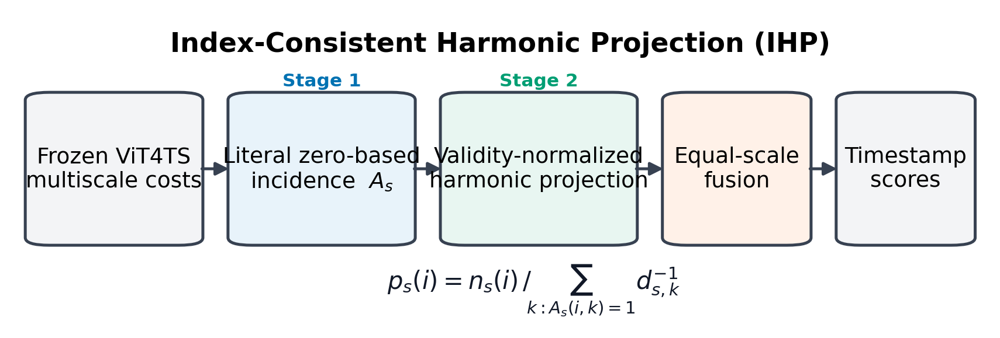
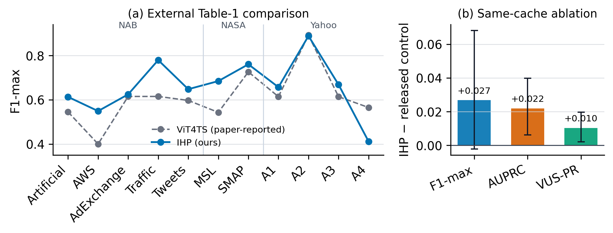

# Index-Consistent Harmonic Projection

This repository contains the compact, reproducible assets for an IEEE MSN
2026 paper under the **Big Data and AI** track. The final method is
**Index-Consistent Harmonic Projection (IHP)**, a label-free and parameter-free
correction to the frozen ViT4TS multiscale projector.



## Core result

IHP was evaluated on 492 time series spanning all 11 NAB, NASA, and Yahoo
subdatasets reported in VLM4TS Table 1.

| Method | F1-max | AUPRC | VUS-PR |
|---|---:|---:|---:|
| Released same-cache control | 0.635409 | 0.297401 | 0.687294 |
| **IHP** | **0.662142** | **0.319212** | **0.697495** |

Against the ViT4TS value copied from the AAAI 2026 paper, IHP has an equal-11
F1-max of `0.662142` versus the paper-reported `0.612` and is higher on 9 of
11 subdatasets. This is an external descriptive comparison, not a paired local
reproduction. The same-cache AUPRC and VUS-PR gains have positive hierarchical
95% confidence-interval lower bounds; the F1-max interval crosses zero.



## Method

The released pooling masks store zero-based base-cell indices, whereas the
released projection queries shifted memberships. IHP uses two coupled stages:

1. **Literal incidence lifting** constructs base-cell/token membership directly
   from the stored zero-based indices.
2. **Support-normalized harmonic pullback** applies the inherited harmonic
   reducer over the corrected support and fuses the frozen token scales.

The topology certificate reports complete `196/196` support for IHP versus
`195/196` shifted support, 13 row-boundary coordinate crossings, and one
terminal hole in the released convention. IHP changes no CLIP weight, memory,
matcher, threshold, or downstream VLM, and adds no backbone forward pass.

## Reproduce the compact package

Install CUDA PyTorch separately, then install the package dependencies:

```powershell
python -m pip install -r code\requirements.txt
python -m pip install -e code
python -m pytest code\tests\test_ihp.py -q
```

Regenerate the figures from the frozen compact CSV files:

```powershell
python code\scripts\ihp_make_figures.py `
  --artifacts artifacts\ihp `
  --output docs\manuscripts\msn2026\figures
```

See [`code/README.md`](code/README.md) for the minimal API and structural-audit
command. Raw datasets, checkpoints, token caches, per-series arrays, failed
routes, and temporary logs are intentionally excluded.
